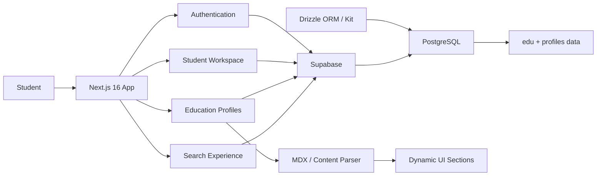

<div align="center">


<br />

# Next Bench 🪑

### Find the right university without getting lost in the process.

A student-first platform for discovering institutions, exploring structured education profiles, and keeping your admission goals in one place.

[**Explore Next Bench ↗**](https://next-bench-dev.vercel.app/) ·
[**Search Institutes**](https://next-bench-dev.vercel.app/search) ·
[**Report a Bug**](https://github.com/ThatKJ/next-bench/issues) ·
[**Request a Feature**](https://github.com/ThatKJ/next-bench/issues)

<br />


</div>

<br />

## ✦ What is Next Bench?

Choosing where to study should not mean jumping between dozens of tabs, scattered institute pages, random reviews, and half-finished notes.

**Next Bench** brings institute discovery and student planning into one clean experience. Students can search universities, colleges, and tuition providers, open structured education profiles, sign in, maintain their personal information, and save admission goals and target universities.

The application is built around a Next.js frontend backed by Supabase, with institute content stored in PostgreSQL and rendered dynamically from structured MDX-like data.

> **The idea is simple:** spend less time searching for information and more time deciding what is actually right for you.

---

## ✨ Highlights

<table>
<tr>
<td width="50%" valign="top">

### 🔎 Institute Discovery

Search across universities, colleges, and tuition providers from a dedicated discovery interface.

Institute results can surface useful information such as location, rating, description, tags, and dedicated profile routes.

</td>
<td width="50%" valign="top">

### 🎓 Dynamic Education Profiles

Every institute can have its own `/edu/[slug]` page.

Profile content is loaded from Supabase and transformed into structured sections for richer education pages instead of hard-coded static routes.

</td>
</tr>

<tr>
<td width="50%" valign="top">

### 👤 Student Profiles

Authenticated students get a personal `/me` area where profile information can be viewed and updated.

Student data is persisted through Supabase-backed profile records.

</td>
<td width="50%" valign="top">

### 🎯 Goals & Dream Universities

Save a personal education goal and keep up to three target universities attached to your profile.

It turns Next Bench from a directory into a lightweight student planning workspace.

</td>
</tr>

<tr>
<td width="50%" valign="top">

### 🌓 Light + Dark Themes

The UI supports persistent light and dark themes using client-side theme preferences.

The interface is built with Once UI and custom styling for a modern, focused experience.

</td>
<td width="50%" valign="top">

### 🧩 Structured Content Engine

Education data supports names, descriptions, ratings, city/state metadata, tags, and rich MDX content.

The institute page renderer can translate that stored content into reusable interface sections.

</td>
</tr>
</table>

---

## 🖥️ Product Preview

<div align="center">


</div>

---

## ⚙️ How it fits together



---

## 🧱 Tech Stack

| Layer | Technology |
| --- | --- |
| **Framework** | Next.js 16 |
| **UI Runtime** | React 19 |
| **Language** | TypeScript 5.8 |
| **Design System** | Once UI |
| **Styling** | Tailwind CSS 4, Sass, custom CSS |
| **Backend / Data** | Supabase |
| **Database** | PostgreSQL |
| **ORM / Schema** | Drizzle ORM + Drizzle Kit |
| **Smooth Motion** | Lenis |
| **Image Processing** | Sharp |
| **Formatting** | Biome |
| **Deployment** | Vercel |

---

## 🗂️ Repository Structure

```text
next-bench/
├── backend/
│   └── python/              # Backend experimentation / workflow area
├── drizzle/                 # Database migration artifacts
├── mdx/                     # Education content / MDX resources
├── next-parser/
│   └── parser.js            # Content parsing utility
├── public/
│   ├── images/og/           # Social / preview assets
│   └── trademarks/
├── src/
│   ├── app/
│   │   ├── auth/            # Authentication flows
│   │   ├── edu/[slug]/      # Dynamic institute profiles
│   │   ├── me/              # Student profile + goals
│   │   ├── search/          # Institute discovery
│   │   ├── supabase/        # Supabase client
│   │   ├── ~/admin/         # Admin-facing route area
│   │   └── components/      # App-level UI
│   ├── components/
│   ├── db/
│   │   └── schema.ts        # Drizzle schema
│   └── resources/           # Theme, config and styles
├── drizzle.config.ts
├── next.config.mjs
├── package.json
└── README.md
```

---

## 🚀 Getting Started

### Prerequisites

You will need:

- **Node.js 20+**
- **npm**
- a **Supabase** project
- a PostgreSQL connection string if you plan to use the Drizzle database tooling

### 1. Clone the repository

```bash
git clone https://github.com/ThatKJ/next-bench.git
cd next-bench
```

### 2. Install dependencies

```bash
npm install
```

### 3. Configure environment variables

Create a `.env.local` file in the root of the project:

```env
NEXT_PUBLIC_SUPABASE_URL=your_supabase_project_url
NEXT_PUBLIC_SUPABASE_PUBLISHABLE_DEFAULT_KEY=your_supabase_publishable_key
DATABASE_URL=your_postgresql_connection_string
```

> `NEXT_PUBLIC_SUPABASE_URL` and `NEXT_PUBLIC_SUPABASE_PUBLISHABLE_DEFAULT_KEY` are required by the application at runtime.
>
> `DATABASE_URL` is used by the Drizzle configuration.

If you use Drizzle Kit directly and your shell does not expose `DATABASE_URL`, also provide it through a root `.env` file or export it in your environment.

### 4. Start development

```bash
npm run dev
```

Open:

```text
http://localhost:3000
```

---

## 🧬 Database

The current schema includes two core application domains:

### `profiles`

Stores student information such as:

- name
- email
- city / state / country
- phone
- personal goal
- target universities
- creation timestamp

### `edu`

Stores institute content such as:

- slug
- name
- description
- rating
- city
- state
- tags
- MDX content

### Drizzle commands

The project includes Drizzle Kit as a development dependency, so you can use:

```bash
npx drizzle-kit generate
```

and:

```bash
npx drizzle-kit migrate
```

Make sure `DATABASE_URL` is configured before running database commands.

---

## 🧭 Core App Routes

| Route | Purpose |
| --- | --- |
| `/` | Landing page |
| `/search` | Search universities, colleges, and tuition providers |
| `/edu/[slug]` | Dynamic institute profile |
| `/auth/...` | Authentication flows |
| `/me` | Student profile, personal details, goals and target universities |
| `/~/admin` | Admin-facing route area |

---

## 🛠️ Development Commands

| Command | Description |
| --- | --- |
| `npm run dev` | Start Next.js in development mode with Turbopack |
| `npm run build` | Create a production build |
| `npm run start` | Start the production server |
| `npm run lint` | Run the configured Next.js lint command |
| `npm run biome-write` | Format the repository with Biome |
| `npm run export` | Run the configured Next.js export command |

---

## 🗺️ Roadmap

Next Bench is still evolving.

- [x] Institute search experience
- [x] Dynamic education profile pages
- [x] Supabase authentication integration
- [x] Student profile management
- [x] Goals and target universities
- [x] Light / dark theme support
- [ ] Personalized student roadmaps

> Personalized roadmap generation is visible in the current student workspace, but is intentionally disabled until the feature is ready.

---

## 🤝 Contributing

Contributions, bug reports, and ideas are welcome.

```bash
# Fork the repo, then clone your fork
git clone https://github.com/YOUR_USERNAME/next-bench.git
cd next-bench

# Create a branch
git checkout -b feature/your-feature

# Install dependencies
npm install

# Start development
npm run dev
```

When your changes are ready:

```bash
git add .
git commit -m "feat: describe your change"
git push origin feature/your-feature
```

Then open a Pull Request.

Before submitting, please make sure the app builds successfully:

```bash
npm run build
```

---

## 🧪 Current Status

Next Bench is under active development.

Some repository areas—including the Python workflow directory and personalized roadmap UI—are currently placeholders or incomplete and should not yet be treated as production features.

If you find something that does not work as expected, please [open an issue](https://github.com/ThatKJ/next-bench/issues).

---

## 🌱 Project History

This repository is maintained at [`ThatKJ/next-bench`](https://github.com/ThatKJ/next-bench) and is forked from [`sonamii/next-bench`](https://github.com/sonamii/next-bench).

Credit to the original contributors and everyone who has helped shape the project.

---

<div align="center">

### Built for students figuring out what comes next.

Search smarter. Compare clearly. Keep your goals in sight.

<br />

[**Try Next Bench ↗**](https://next-bench-dev.vercel.app/)

<br /><br />

If this project helps you, consider giving it a ⭐

</div>
